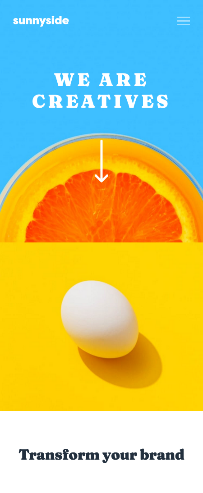

# Frontend Mentor - Sunnyside agency landing page solution

This is a solution to the [Sunnyside agency landing page challenge on Frontend Mentor](https://www.frontendmentor.io/challenges/sunnyside-agency-landing-page-7yVs3B6ef). Frontend Mentor challenges help you improve your coding skills by building realistic projects.

## Table of contents

- [Overview](#overview)
  - [The challenge](#the-challenge)
  - [Screenshot](#screenshot)
  - [Links](#links)
- [My process](#my-process)
  - [Built with](#built-with)
  - [What I learned](#what-i-learned)
- [Author](#author)

## Overview

### The challenge

Users should be able to:

- View the optimal layout for the site depending on their device's screen size
- See hover states for all interactive elements on the page

### Screenshot

### Links

- Solution URL: [https://github.com/norman02/sunnyside-agency-landing-page.git](https://github.com/norman02/sunnyside-agency-landing-page.git)
- Live Site URL: [https://sunnyside-agency-landing-page-tau.vercel.app/](https://sunnyside-agency-landing-page-tau.vercel.app/)

## My process

### Built with

- Semantic HTML5 markup
- CSS Grid
- Mobile-first workflow
- 7-1 Pattern
- JavaScript
- [Sass](https://sass-lang.com/) - CSS preprocessor

### What I learned

This project was a good challenge for CSS grid. I think I made my life difficult by griding the sections seperately.

## Author

- Frontend Mentor - [@norman02](https://www.frontendmentor.io/profile/norman02)
- Twitter - [@JohnIsNorman](https://www.twitter.com/JohnIsNorman)

